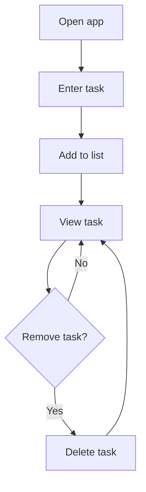

<p align="center">
  
</p>

<h1 align="center">To-Do List</h1>

<p align="center">
  <i>A lightweight browser-based to-do list app built with HTML, CSS, and vanilla JavaScript for simple task management.</i>
</p>

<p align="center">
  
  
  
  
  
  
  
</p>

## Table of Contents

- [🚀 Project intro](#-project-intro)
- [📁 Project structure](#-project-structure)
- [⭐ Differentiators](#-differentiators)
- [🔧 Features](#-features)
- [🧰 Tech stack](#-tech-stack)
- [⚙️ Install methods](#️-install-methods)
- [ Deployment notes](#-deployment-notes)
- [🤝 Contributing](#-contributing)
- [📄 License](#-license)

## 🚀 Project intro

This project is a simple personal task manager that runs entirely in the browser. The interface includes an input field, an add button, and a dynamic task list that updates as the user interacts with it.

## 📁 Project structure

```text
to-do-list-html/
├── index.html
├── LICENSE
├── README.md
├── css/
│   └── style.css
├── Images/
│   └── icon.png
└── js/
    └── script.js
```

## ⭐ Differentiators

- Built as a lightweight static web app with no framework or build step required
- Uses plain JavaScript for direct DOM interaction and simple task management
- Keeps the experience easy to run locally and easy to extend for learning or small projects

## 🔧 Features

| Feature | Status | Description |
| --- | :---: | --- |
| Add tasks | ✅ | Users can enter a task and add it to the list with the Add to list button. |
| Remove tasks | ✅ | Each task includes a delete action so it can be removed from the list. |
| Dynamic updates | ✅ | The task list updates immediately as items are added or removed. |
| Simple styling | ✅ | Basic layout and hover effects make the interface more polished. |

### 🔄Flow diagram



## 🧰 Tech stack

- **Framework:** None — built as a lightweight static web app
- **Structure:** HTML5 for page layout and content
- **Styling:** CSS3 for layout, colors, spacing, and hover effects
- **Interactivity:** Vanilla JavaScript for DOM updates and task handling
- **Storage:** No database required; tasks are managed in the browser

## ⚙️ Install methods

### 📦 Open locally

1. Clone or download this repository.
2. Open the project folder in your preferred code editor.
3. Launch the app by opening the index.html file in a browser.

No package installation or build process is required.


## 🚀 Deployment notes

This project is a static website, so it can be hosted on any simple web hosting service that serves files directly from the project folder. GitHub Pages is a suitable option for deployment.

## 🤝 Contributing

Contributions are welcome. If you would like to improve the app, feel free to open a pull request with your changes and a short description of what you updated.

## 📄 License

This project is licensed under the Apache License 2.0. See the LICENSE file for more information.
